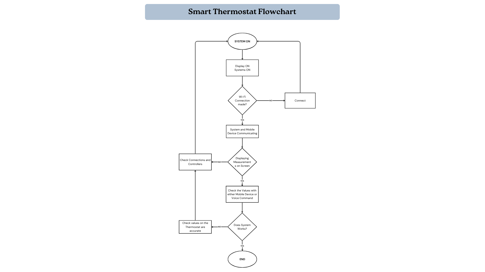
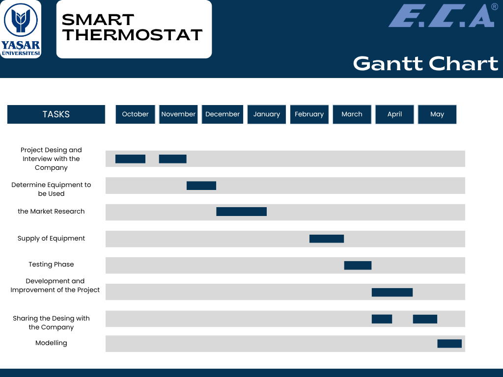
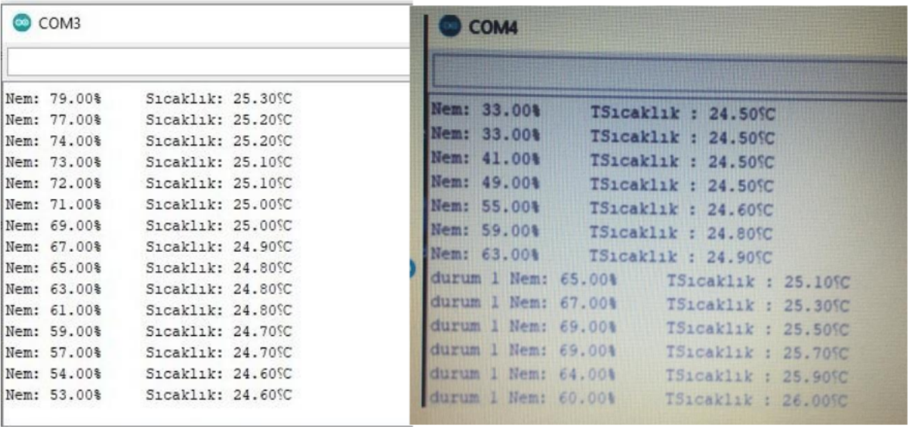
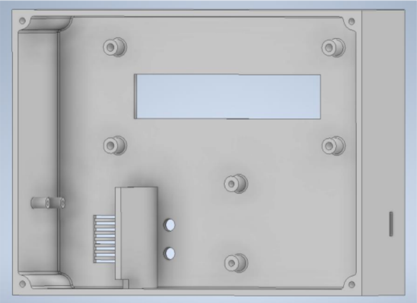

# Smart Thermostat

Wi-Fi enabled smart room thermostat with cloud connectivity and voice control.

## Overview

This project was developed as my Bachelor's graduation project in Electrical and Electronics Engineering.

The objective was to design a smart room thermostat that can be monitored and controlled remotely through a Wi-Fi connection while providing voice control functionality using cloud services.

## Features

- Wi-Fi communication
- Cloud-based remote monitoring
- Voice control with Google Assistant
- Temperature and humidity monitoring
- Mobile application integration
- Real-time control over the local network

## System Architecture

## Project Planning

The project development process was planned and tracked using a Gantt chart.

## Project Gallery

### Prototype

### Circuit

## Enclosure Design

The project enclosure was designed to accommodate the electronic components and provide a compact and practical housing for the thermostat system.

### System in Operation

### Blynk Mobile Application

## Hardware

- ESP8266 NodeMCU
- DHT11 Temperature & Humidity Sensor
- Relay Module
- Power Supply
- Room Thermostat Components

## Software

- Arduino IDE
- Blynk
- Google Assistant
- IFTTT
- Webhook

## Technologies

- Embedded Systems
- Internet of Things (IoT)
- Cloud Computing
- Sensor Integration
- Home Automation

## Project Status

Completed as a Bachelor's Graduation Project.

## Documentation

The complete project report is available here:

- 📄 [Smart Thermostat Project Report](docs/Smart_Thermostat_Report.pdf)

## Future Improvements

- Mobile application improvements
- Cloud database integration
- Historical temperature logging
- Energy consumption analysis
- AI-based temperature prediction

## Author

Ata Yılmaz

Electrical & Electronics Engineer

M.Sc. Student in Smart Systems
